# Frontend Mentor - Rock, Paper, Scissors solution

This is a solution to the [Rock, Paper, Scissors challenge on Frontend Mentor](https://www.frontendmentor.io/challenges/rock-paper-scissors-game-pTgwgvgH).

Frontend Mentor challenges help you improve your coding skills by building realistic projects.

## Table of contents

- [Frontend Mentor - Rock, Paper, Scissors solution](#frontend-mentor---rock-paper-scissors-solution)
  - [Table of contents](#table-of-contents)
  - [Overview](#overview)
    - [The challenge](#the-challenge)
    - [Screenshot](#screenshot)
    - [Links](#links)
  - [My process](#my-process)
    - [Built with](#built-with)
  - [Author](#author)

## Overview

### The challenge

Users should be able to:

- View the optimal layout for the game depending on their device's screen size
- Play Rock, Paper, Scissors against the computer
- Maintain the state of the score after refreshing the browser _(optional)_
- **Bonus**: Play Rock, Paper, Scissors, Lizard, Spock against the computer _(optional)_

### Screenshot

Desktop:
ORIGINAL GAME : ROCK PAPER SCISSORS
| 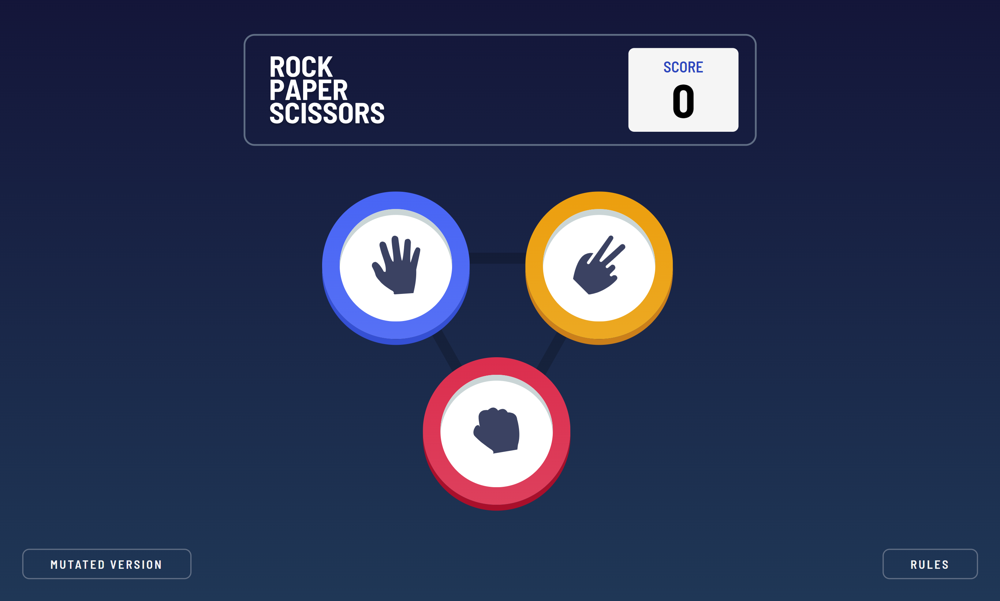 | 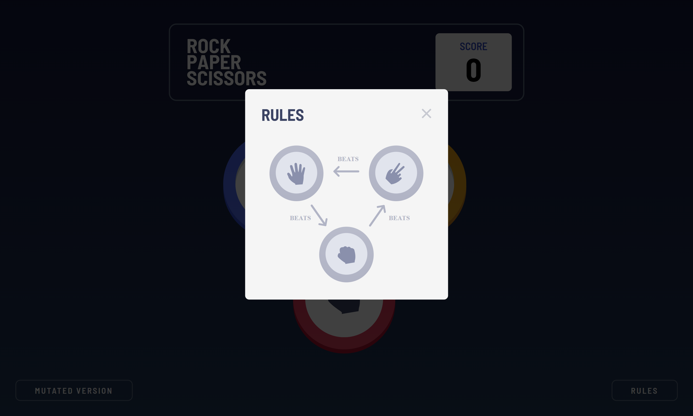 |
| :-----------------------------------------------------: | :-----------------------------------------------------: |

MUTATED GAME : ROCK PAPER SCISSORS LIZARD SPOCK
| 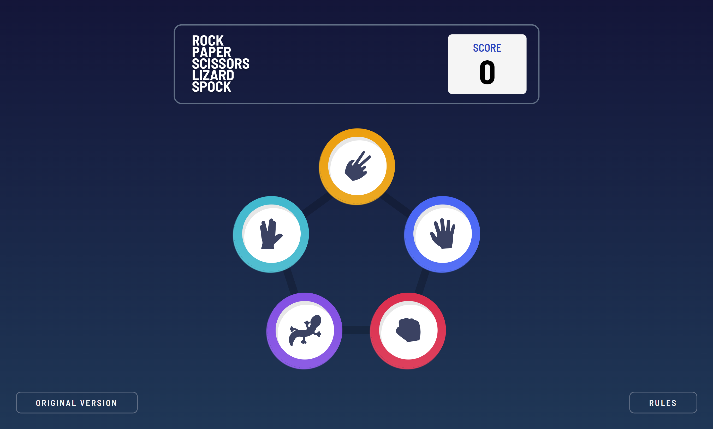 | 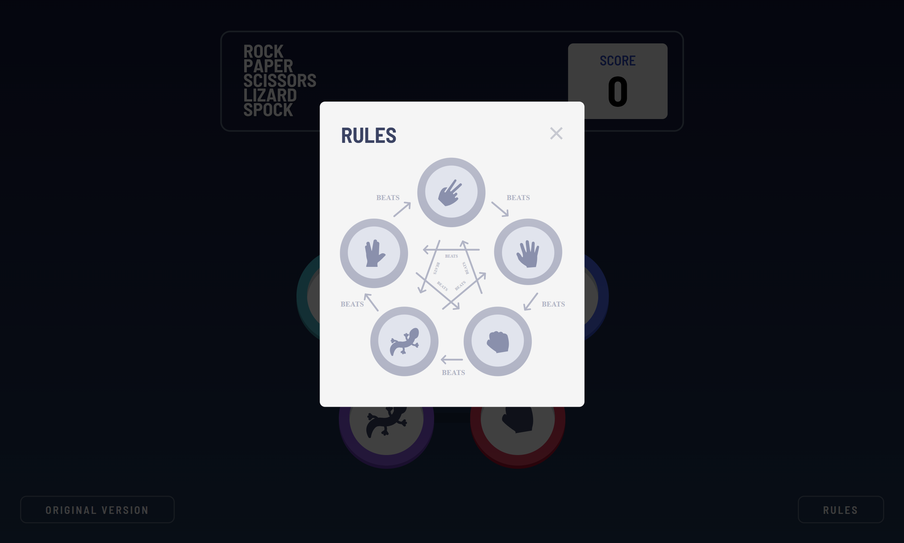 |
| :-----------------------------------------------------: | :-----------------------------------------------------: |

DIFFERENT GAME STATES
| 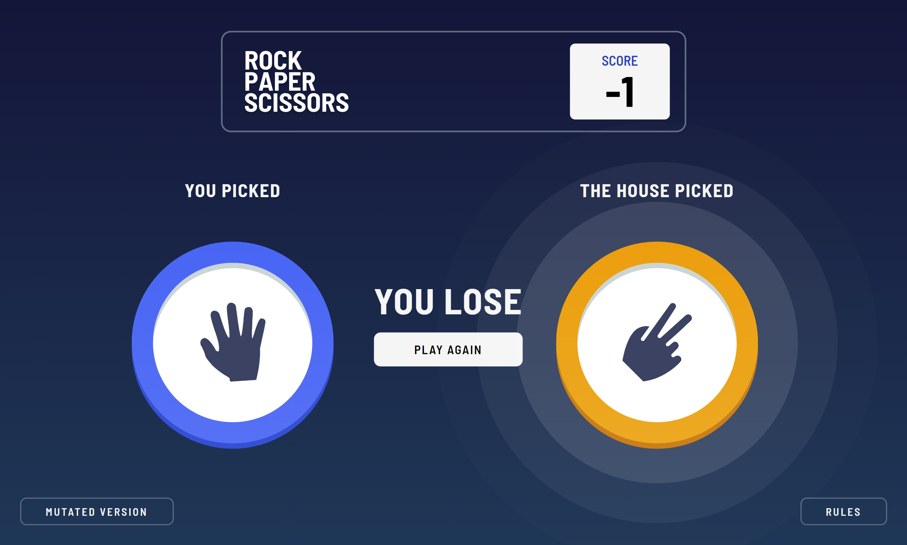 | 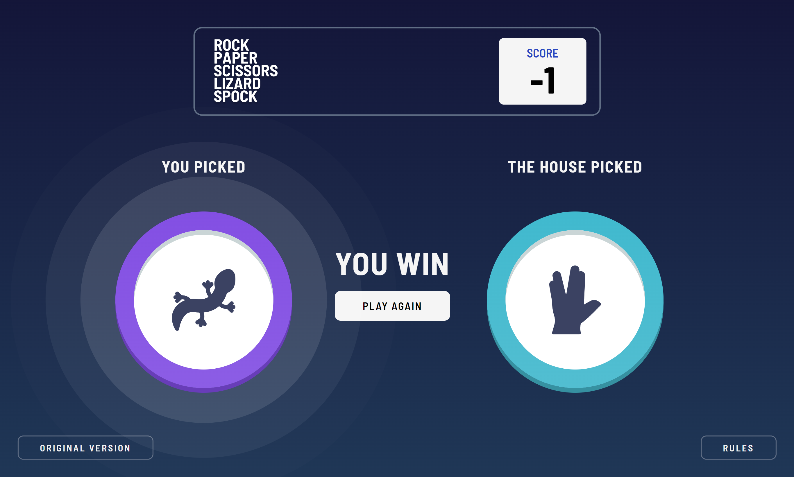 |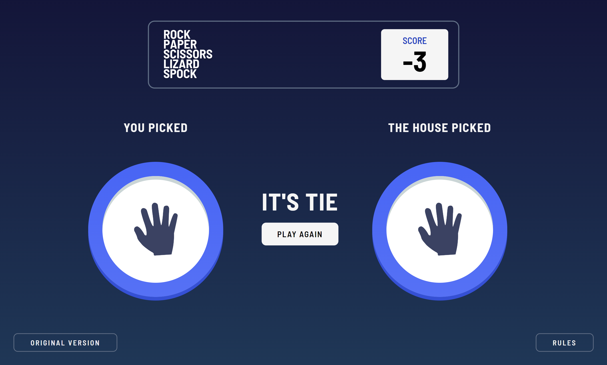 |
| :-----------------------------------------------------: | :-----------------------------------------------------: |  :-----------------------------------------------------: |

Mobile:

ORIGINAL GAME : ROCK PAPER SCISSORS
| 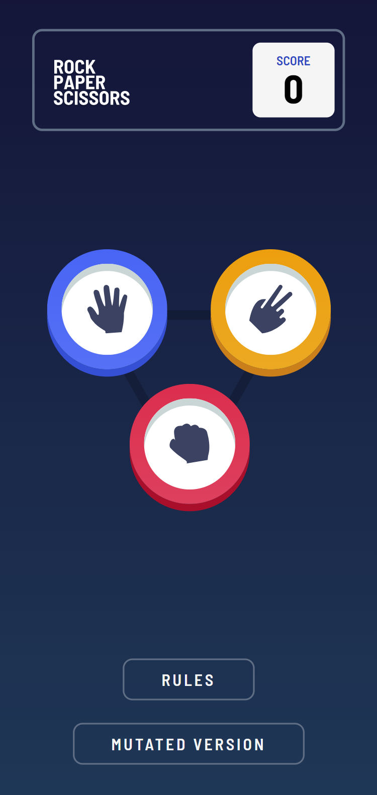 | 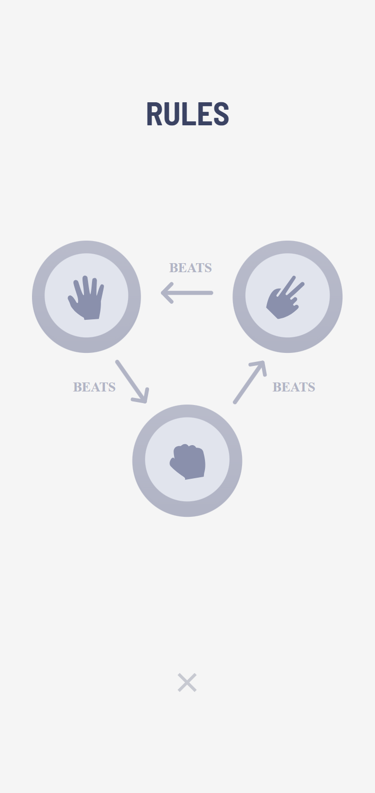 |
| :-----------------------------------------------------: | :-----------------------------------------------------: |

MUTATED GAME : ROCK PAPER SCISSORS LIZARD SPOCK
| 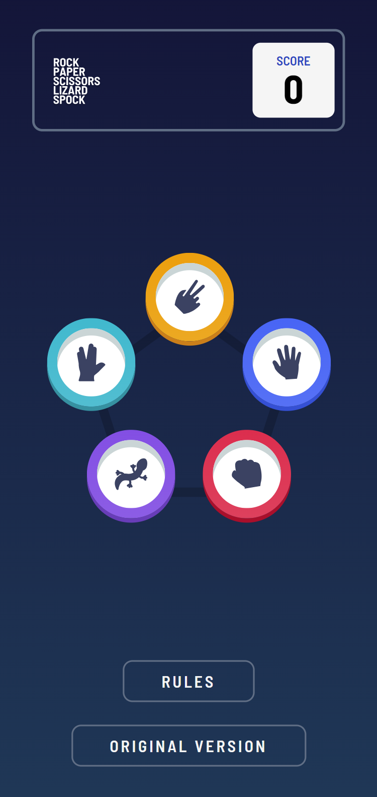 | 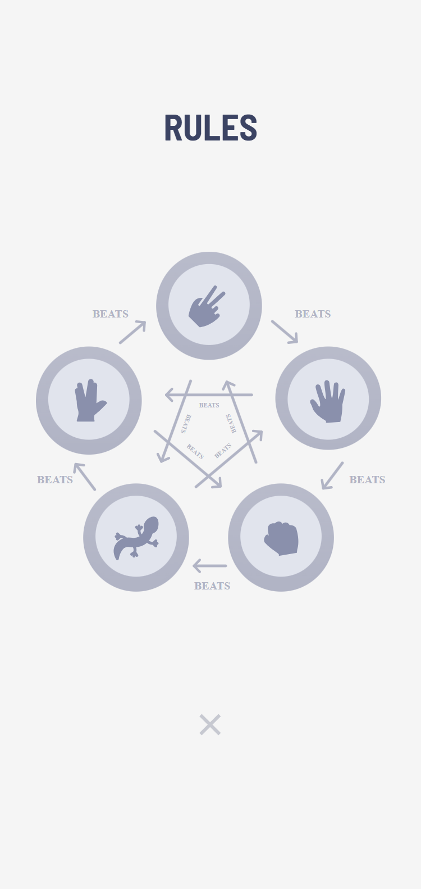 |
| :-----------------------------------------------------: | :-----------------------------------------------------: |

DIFFERENT GAME STATES
| 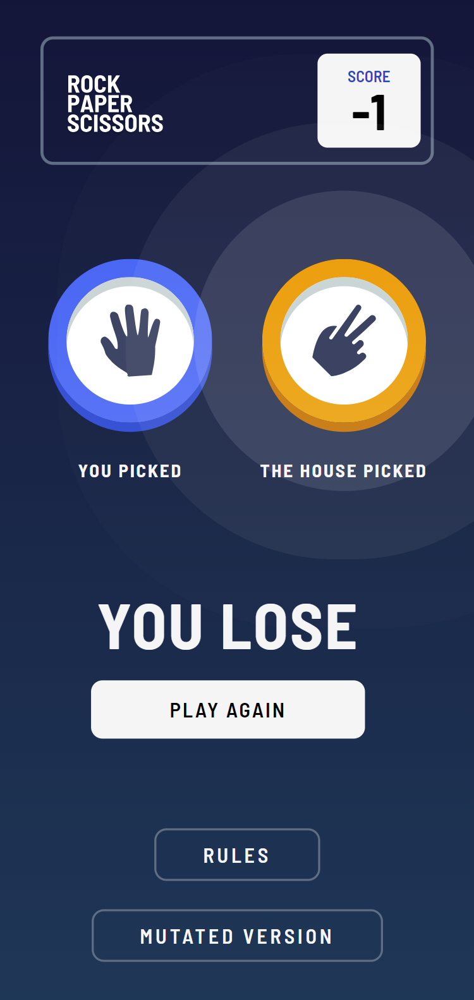 | 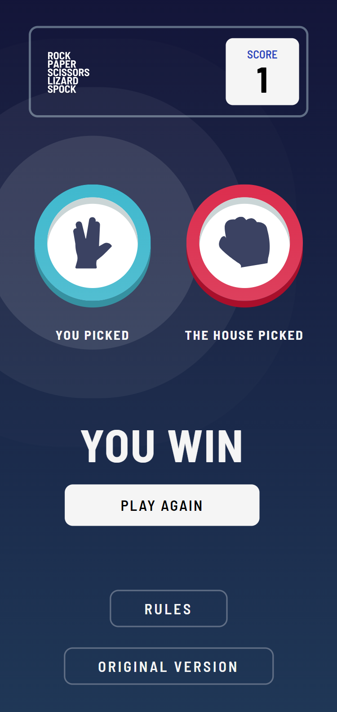 |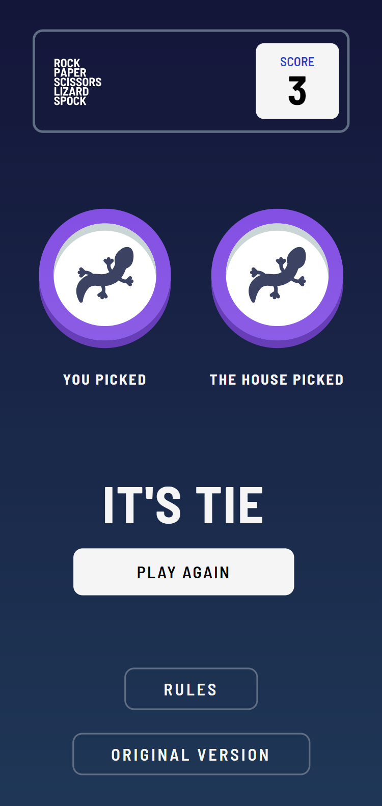 |
| :-----------------------------------------------------: | :-----------------------------------------------------: |  :-----------------------------------------------------: |

### Links

- [Live Demo](https://wess-mhhw.github.io/rock-paper-scissors/)

## My process

### Built with

- Semantic HTML5 markup
- CSS custom properties
- CSS Grid
- Javascript

## Author

- Frontend Mentor - [@wess-MHHW](https://www.frontendmentor.io/profile/wess-MHHW)
- LeetCode - [@wess-MHHW](https://leetcode.com/wess-MHHW/)
- Linkedin - [@wassim-maaoui](https://www.linkedin.com/in/wassim-maaoui/)
